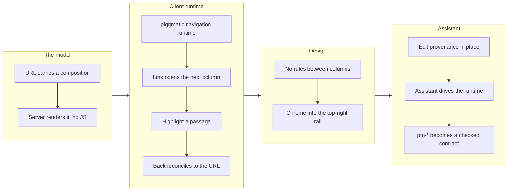

# The column strip becomes a real navigation surface

_Mission `make-the-column-strip-a-real-navigation-surface`, complete at 11/11 in one drive. Branch cut from `work-20260723-003825` (PR #87) so it inherits the voice surface — see Notes for the ship order._

## 1. Overview

The column strip was a picture of horizontal orientation rather than a working
one: every drill was an `<a href>` that reloaded the page, so the browser threw
the strip away and the server rebuilt it. Nothing accumulated, and any live
client state died on each click. This branch makes the strip real. A URL now
carries a **composition** — an ordered list of `(route, optional highlighted
passage)` — the server renders it with no JavaScript, and a dependency-free
runtime in plggmatic places columns without a page load.

**Highlights:**

1. `/concepts/?c=/getting-started,/packages/plgg/` renders three content columns
   server-side, with no JavaScript at all. A plain page URL is unchanged.
2. Clicking a link opens its target as the column to its right; the page you
   were reading stays in place, still scrolled where you left it. Back removes
   that column, Forward brings it back.
3. A composition URL can mark a passage — and a quotation not found in the
   document exactly once **marks nothing at all**, so a false highlight cannot
   be displayed.

## 2. Motivation

The strategy claims depth is expressed by columns expanding rightward and that
"depth does not consume the viewport". A full reload per drill consumes the
whole viewport every time, so the artifact contradicted the claim. The
assistant made the gap concrete: navigating the browser would destroy the
`RTCPeerConnection` and the conversation with it, which is exactly what the
reload arbiter was written to prevent — so "take me to that section" could not
be built on navigation at all.

The model was chosen to answer a second question at the same time. Asked
whether the assistant could assemble columns from documents that are *not*
link-connected — quoting a passage from each to make a point — a strip modelled
as a walked trail cannot express it. Modelled as a composition it can, with
link-following as the case where the list grew by one. That generalization cost
nothing here and is why the follow-on corpus work will be cheap.

## 3. Changes

The gating decision came first and alone: the composition in the URL and its
server rendering, verifiable with no JavaScript, because it is the one choice
that could not be changed afterwards. Everything else is built on it.

### 3-1. Model the strip as a URL-carried composition ([07f4911a](https://github.com/qmu/plgg/commit/07f4911a))

A URL can open several documents side by side —
`/concepts/?c=/getting-started,/packages/plgg/` renders three content columns,
server-side, with no JavaScript. A plain page URL is unchanged.

### 3-2. Give plggmatic its first client navigation runtime ([952b44c3](https://github.com/qmu/plgg/commit/952b44c3))

`window.__pmNav.open(route)` fetches the target's own server-rendered page,
places its column in the strip and pushes the composition URL — a
dependency-free inline runtime shaped like the existing `appearanceInitScript`.

### 3-3. Open a followed link as the next column ([cc8003a1](https://github.com/qmu/plgg/commit/cc8003a1))

Clicking a link opens its target to the right, with the originating column left
untouched; opening from a middle column closes the columns beyond it. Modified
clicks, external links, downloads and same-page fragments are unaffected.

### 3-4. Highlight only what the document actually says ([009ca8ae](https://github.com/qmu/plgg/commit/009ca8ae))

A composition URL can mark a passage, and the column opens with it highlighted
and scrolled into view. A quotation not present exactly once marks nothing — the
document still renders, the false highlight simply does not exist.

### 3-5. Reconcile the strip to the URL on Back ([37b2e16d](https://github.com/qmu/plgg/commit/37b2e16d))

Back removes the column the matching navigation added and Forward brings it
back, repeatedly, with no page load; columns that stay keep their DOM nodes and
scroll positions.

### 3-6. Prove the no-JavaScript path with a test ([de848721](https://github.com/qmu/plgg/commit/de848721))

Nothing changes for a reader without JavaScript — what changed is that a
regression now fails the build.

### 3-7. Draw no rules between the strip's columns ([2b7753da](https://github.com/qmu/plgg/commit/2b7753da))

No rule appears between any two columns. The two choice-list columns render
their entries as a text-width block centred in the column, equal space either
side, every entry on a common left edge.

### 3-8. Group every control at the top right ([176a45a0](https://github.com/qmu/plgg/commit/176a45a0))

GitHub and the light/dark control sit at the top of the rightmost bar with the
assistant's dialog beside them; the sections column carries navigation only, at
every breakpoint.

### 3-9. Show what the assistant changed, in place ([d722c44a](https://github.com/qmu/plgg/commit/d722c44a))

The changed passage shows what it was, struck through, beside what it became —
in the prose itself — and survives the in-place content swap that follows.

### 3-10. Let the assistant open columns through the runtime ([3679590c](https://github.com/qmu/plgg/commit/3679590c))

Asking the assistant to open a document opens it as the next column exactly as
the click would, with the realtime session alive across every column.

### 3-11. Make plggmatic's names a checked contract ([b06c70e1](https://github.com/qmu/plgg/commit/b06c70e1))

plggmatic exports every hook it guarantees, plggpress names them by import, and
a gate fails the build if a covered consumer types one.

## 4. Outcome

11/11 acceptance. The strip is a navigation surface: compositions are
addressable and shareable, links open columns, Back closes them, highlights are
provably from the document, the design requirements (no rules, centred choice
lists, chrome in the top-right rail) are met, and the assistant drives the same
runtime the pointer does. The `pm-*` string-matching concern is retired.

## 5. Historical Analysis

The branch repeats the pattern the plgg-test mission established two days
earlier: put the decision that cannot be revised first, verify it in the cheapest
possible medium, and build only after. There it was a profiling spike before any
implementation; here it was the URL format, proven with no JavaScript, before a
line of runtime. Both missions also refused a flattering number — plgg-test
re-measured its own baseline rather than quote an inflated archived one, and this
branch's `pm-*` ticket reports that its stated goal was wrong rather than
claiming it.

## 6. Concerns

### The runtime's decisions are asserted in a browser, not by the compiler

- **Severity:** moderate
- **Description:** An inline runtime cannot import TypeScript, so its rules live
  in a string constant (see [952b44c3](https://github.com/qmu/plgg/commit/952b44c3)). A pure decision module beside it would be a
  second implementation of the same rules, so the script publishes its decisions
  on the hook and they are asserted in a real browser; the TS specs assert only
  what is statically checkable.
- **How to Fix:** If the runtime grows, generate it from a checked source rather
  than hand-maintaining a larger string.

### A renamed hook makes consumers follow, not fail

- **Severity:** moderate
- **Description:** The ticket asked for a rename to become a compile error;
  renaming `cssPrefix` from `pm` to `zz` left plggpress green and changed its
  rendered markup to `zz-row`/`zz-col` (see [b06c70e1](https://github.com/qmu/plgg/commit/b06c70e1)). The consumer follows the
  framework — arguably the stronger property, but it is not the guarantee the
  mission asked for, and a third-party stylesheet would still break silently.
- **How to Fix:** Decide whether the published prefix is part of the contract; if
  it is, pin it with a test on the rendered markup, not on the constant.

### Highlights locate in rendered text, edits locate in markdown

- **Severity:** low
- **Description:** The highlight locator runs over the rendered text while
  `edit_doc` runs over the markdown source (see [009ca8ae](https://github.com/qmu/plgg/commit/009ca8ae)). That is deliberate — a
  reader quotes what they see — but the two can disagree for a passage whose
  markup differs from its rendering.
- **How to Fix:** Document the distinction where both verbs are described; revisit
  if a quotation ever needs to round-trip between them.

### Nav-column clicks still perform a full navigation

- **Severity:** low
- **Description:** Only content columns carry the placeable marker, so a click in
  the sections or drilled nav column still reloads (see [cc8003a1](https://github.com/qmu/plgg/commit/cc8003a1)).
- **How to Fix:** Extend the marker to nav columns once the composition semantics
  for a nav click are decided (does choosing a section replace the strip or extend
  it?).

## 7. Successful Development Patterns

- **Put the irreversible decision first and prove it in the cheapest medium.**
  The composition URL was driven alone and verified with no JavaScript; every
  later ticket rested on a format that was already settled.
- **Reconcile to the state, don't undo the action.** Making Back reconcile the
  strip to the URL — rather than reversing the last navigation — collapsed Back,
  Forward, multi-step Back and a pasted URL into one operation.
- **Offer the model an enum, don't validate its string.** The assistant's route
  argument is an enum of the site's own routes enumerated server-side at mint
  time, so a prompt-injected target has no argument value to land in.
- **Assert the property, don't assume it.** Scroll preservation needed no code —
  the originating column's DOM node is never touched — so the work was writing
  the assertion rather than the feature.
- **The cheap no-JS assertion.** Deleting every `script` element from the served
  response must change nothing; that answers "does it work without JavaScript"
  from the markup alone, so it runs on every commit instead of in a browser
  session someone has to remember to open.
- **Report the ticket's premise as wrong when it is.** The `pm-*` ticket's stated
  goal (a rename becomes a compile error) turned out to be the wrong goal for a
  string constant, and the commit says so instead of claiming success.

## 8. Release Preparation

**Verdict**: Ready for release, behind PR #87

### 8-1. Concerns

- **Ship order.** This branch was cut from `work-20260723-003825` (PR #87) so it
  could inherit the voice surface, and carries 42 commits relative to `main`
  against 13 of its own. PR #87 must merge first, or this PR carries its work
  too. Both #87 and #89 currently report `CONFLICTING` against `main`
  (tip `5cee0804`) and need a merge-from-main plus a fresh gate before either
  can ship.
- The runtime is asserted in a browser rather than by the compiler (see §6).

### 8-2. Pre-release Instructions

- Merge `main` into `work-20260723-003825`, resolve, re-gate, ship PR #87.
- Then merge `main` into this branch, re-run `./scripts/check-all.sh` on a
  settled tree and `cd packages/guide && npm run build`.

### 8-3. Post-release Instructions

- Retire the temporary `plgg-strip.qmu.dev` review host (ingress rule plus the
  `allowedHosts` entry) once the work is on `main` and `plgg-guide.qmu.dev`
  serves it.
- The follow-on corpus mission (site index at mint, a read-a-passage verb, the
  argument object) is what this branch's composition model was shaped to enable.

## 9. Notes

Reviewable live at `https://plgg-strip.qmu.dev` (port 4130, this worktree),
deliberately beside `https://plgg-guide.qmu.dev` rather than replacing it, so
the previous state stays available for comparison. Both are behind Cloudflare
Access.
