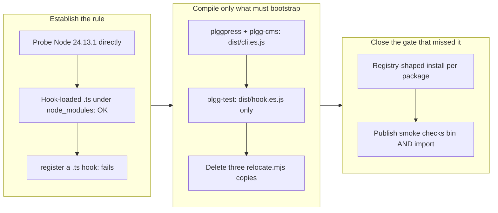

## 1. Overview

The `relocate.mjs` `/tmp` copy-and-re-exec hack is gone from the monorepo. Three packages
shipped their own verbatim copy of a 118-line helper that copied the whole installed
package out of `node_modules` and re-executed it there, because Node refuses to strip
types from a `.ts` under `node_modules` and each of these tools ran its CLI from source.
`plgg-bundle` retired its copy earlier by shipping a compiled `dist/cli.es.js`; this
branch retires the last three — and finds that only two of them actually needed that
answer.

**Highlights:**

1. `plggpress` and `plgg-cms` follow the `plgg-bundle` precedent exactly: their CLI is
   now a `cli` entry in their existing bundle config, and the launcher runs
   `dist/cli.es.js` when the package's realpath is under `node_modules`, the `.ts`
   source otherwise.
2. `plgg-test` needed almost none of it. Its resolver hook already owns `.ts` loading —
   it transpiles with `ts.transpileModule` and short-circuits Node's default loader — so
   Node's `node_modules` restriction never applied to anything the hook handled. Exactly
   **one** file was ever the problem: the hook itself. Compiling that one file
   (`dist/hook.es.js`) retires the whole relocation.
3. The publish install smoke had a hole shaped like this defect: it returned `import ok`
   the moment a package declared `main`/`exports`, skipping the bin check entirely — so
   the three packages that publish *both* surfaces had their launchers smoked by nothing
   at all. Both surfaces are now checked.

## 2. Motivation

The hack was never one hack. It was one file copied into four packages, and the copies
had already begun to mean different things: `plgg-bundle`'s was retired while three
identical siblings lived on, and a concern filed in July recorded that a stale
`/tmp/plgg-relocate-*` cache silently swallows a hot-patch to a consumer's
`node_modules` — a verification gotcha that only exists because the cache exists. The
follow-on ticket was written at the same time as the `plgg-bundle` one precisely so the
proven pattern could be applied once and the hack removed from the tree rather than
left as three dormant copies of a workaround nobody would revisit.

## 3. Changes

The branch starts by establishing the actual rule rather than assuming it.
`ERR_UNSUPPORTED_NODE_MODULES_TYPE_STRIPPING` turns out to be a property of Node's
*default* loader, not of a file's location: a registered `load` hook that returns
transpiled source and short-circuits loads `.ts` under `node_modules` perfectly well,
including the process entry point. That single measurement is what splits the three
packages into two different fixes, and it is why `plgg-test` did not get a self-bundled
CLI it did not need.

### 3-1. Retire relocate.mjs in the last three bin consumers ([177a82cb](https://github.com/qmu/plgg/commit/177a82cb))

Deletes all three `bin/relocate.mjs` copies and replaces them with the location switch
`plgg-bundle` already proved: `plggpress` and `plgg-cms` gain a `cli` entry in their
bundle config and run the compiled `dist/cli.es.js` under `node_modules`, while
`plgg-test` gains only a compiled `dist/hook.es.js` that its `register.mjs` picks in a
registry install — everything else `.ts` still loads through the hook's own transpiling
`load`. Also closes the publish smoke's bin-check hole, so a package that exports a
library *and* ships a bin has both surfaces proven before it ships.

## 4. Outcome

No plgg CLI copies itself to `/tmp` any more, and no `/tmp/plgg-relocate-*` cache is
created by any of them. Each of `plgg-test`, `plggpress` and `plgg-cms` was verified in
a real registry-shaped install — a real directory under `node_modules` holding only its
`package.json` `files` allowlist, with its dependencies resolvable beside it:
`plggpress --help` and `plgg-cms --help` run clean, and the installed `plgg-test` ran a
purpose-built target package's specs (2 passed) and its `--coverage` gate, exercising
self-alias, cross-package bare and relative `.js`→`.ts` resolution through the compiled
hook. The monorepo run-from-source path is unchanged for all three, `check-all.sh` is
green end to end (39 checks), and `publish.ts --dry-run` stages and packs all three.

The July concern about the stale bin cache is resolved by construction: there is no
cache left to go stale.

## 5. Historical Analysis

This is the second half of a two-ticket pair written together in July. The first
(`20260718210515`, merged earlier) established the compiled-dist launcher on
`plgg-bundle` itself and deliberately scoped itself to that one package so the pattern
could be proven before being spread. That sequencing paid off in an unexpected way: by
the time the pattern reached these three packages, it was clear enough to notice that
one of them did not need it — which is the opposite of what a same-day bulk migration
would have produced.

The repeating pattern this branch adds to is the one the repository keeps rediscovering:
a verification that passes locally because a sibling artifact happens to be present, and
fails on a clean or registry-shaped tree. `check-all.sh` already carries two comments
about it (the cross-runtime gate's placement, the `plggmatic@0.2.1` dist-less publish).
The publish smoke's `return "import ok"` was the same class one level up — a gate that
looked like it covered the bin and did not.

## 6. Concerns

### The claim heartbeat commits the index, not nothing

- **Severity:** moderate
- **Description:** `heartbeat.sh` documents itself as an empty commit that "changes no
  file so it never reaches the PR diff", but it commits whatever is staged. This run's
  first heartbeat swept three staged `relocate.mjs` deletions into a commit titled
  `Refresh heartbeat` (see [74741928](https://github.com/qmu/plgg/commit/74741928)); the
  content is correct on the branch, but the subject describes none of it, so `git log`
  and any story generated from commit subjects misattributes real work to coordination
  noise. This is a defect in the `workaholic` plugin, not in this repository, so it is
  recorded here rather than ticketed in this queue.
- **How to Fix:** File it against the plugin repository through `/request` (the
  sanctioned cross-repository route). The fix is for `heartbeat.sh` to commit an
  explicitly empty tree (`git commit --allow-empty` against a pristine index, or refuse
  to beat while the index is dirty and say so) rather than whatever happens to be
  staged.

### plgg-test emits an unused dist/hook.cjs.js

- **Severity:** low
- **Description:** `formats` is a per-config setting, not per-entry, so adding the `hook`
  entry to `plgg-test`'s library config emits a CJS sibling alongside the ESM one (see
  [177a82cb](https://github.com/qmu/plgg/commit/177a82cb) in
  `packages/plgg-test/bundle.config.ts`). Nothing imports it — the loader thread only
  ever registers `hook.es.js` — and under `"type": "module"` a `.cjs.js` file would be
  misread as ESM if anything ever did.
- **How to Fix:** Either make `formats` overridable per entry in `plgg-bundle`'s config
  schema, or leave it: the file is inert dead weight of ~4 KiB and the alternative is a
  bundler change with a wider blast radius than the problem.

### The four launchers now share a predicate rather than a helper

- **Severity:** low
- **Description:** The ticket asked to factor any shared launcher helper that emerged.
  What is genuinely common across the four `bin/*.mjs` files after this change is one
  predicate — "is my realpath under `node_modules`" — about five lines. Factoring it
  would mean a new runtime dependency edge, because a bin cannot import from a
  devDependency (absent in a registry install), and `plgg-bundle` is a devDependency for
  two of the three.
- **How to Fix:** Nothing, deliberately — trading a dependency edge for five lines is
  the wrong side of vendor-neutrality, and the duplication that actually mattered (a
  copied 118-line hack, three times) is gone. Revisit only if a fourth behaviour joins
  the predicate.

## 7. Successful Development Patterns

- **Probe the runtime rule before designing around it.** A ten-line scratch experiment
  against Node 24.13.1 established that a short-circuiting `load` hook loads `.ts` under
  `node_modules` — including the entry point — which is what revealed that `plgg-test`
  needed one compiled file rather than a self-bundled CLI. The assumed answer would have
  worked and been wrong in a way that only shows up later: `plgg-test`'s Runner registry
  is a module singleton, so a bundled CLI plus a `src`-aliased `plgg-test` import in the
  target's specs would have been two registries and a runner reporting zero tests.
- **Reproduce the deployment shape, not a proxy for it.** The acceptance was written as
  "in a real registry-style install", and building exactly that (a real directory under
  `node_modules` holding only the `files` allowlist, dependencies symlinked beside it)
  cost a few lines of shell and proved the property directly — including the negative
  half, that no `/tmp/plgg-relocate-*` directory appears.
- **When a defect survives a gate, fix the gate in the same change.** The publish
  smoke's early `return` was found while working out how the acceptance would be
  enforced, not by a separate audit — closing it there means the next launcher
  regression fails loudly instead of shipping.
- **Let the existing target do the work.** The `library` bundle target already emits
  what a Node CLI wants (own source inlined, declared deps external), so a package
  needing both a `.d.ts` surface and a compiled CLI adds one more `entries` item rather
  than switching `target`, which is per-config and would drop the declaration tree.

## 8. Release Preparation

**Verdict**: Ready for release

### 8-1. Concerns

- The change alters how three published packages resolve their CLI at runtime, so its
  real exposure is the registry install shape rather than the monorepo. That shape was
  exercised directly for all three (bin run, specs run, coverage gate run) and the
  publish smoke now enforces it on every future publish.
- `plgg-test`, `plggpress` and `plgg-cms` must each be **built before publish**: their
  bins now depend on `dist/cli.es.js` / `dist/hook.es.js` existing. `publish.ts`'s
  staging check already fails loudly on a declared entry the stage does not hold, and
  `build.sh` runs before any publish, so this is covered rather than a manual step.

### 8-2. Pre-release Instructions

- None — standard release process applies. `scripts/build.sh` already produces the new
  dist entries in dependency order.

### 8-3. Post-release Instructions

- None — no special post-release actions needed.

## 9. Notes

The branch-safety scan reports one overridable `size` finding: 568 non-generated changed
lines against a 500-line threshold, on
[177a82cb](https://github.com/qmu/plgg/commit/177a82cb). The bulk of it is deletion —
three 118-line copies of `relocate.mjs` — plus the ticket's own Final Report. The change
is one coherent unit (it is not reviewable split across packages, since the point is
that the hack is gone from *all* of them), so it is recorded here rather than resolved
by splitting.

This unit's effective merge policy is `review`: none of its tickets records a
`merge_policy`, and absent means review.

**The story commit carries an incidental corpus migration.** Reading the open concerns
runs the feedback stream's living migration (`migrate-concerns.sh`, idempotent,
best-effort), which relocated 151 legacy `.workaholic/concerns/*.md` records into
`.workaholic/feedbacks/` under their timestamped names and dropped the old
`concerns/index.md`. It is pure rename with no content change, it was triggered by the
report flow rather than authored here, and it happens on whichever branch reads the
concerns first — noted so a reviewer reads the file count as migration rather than as
this branch's work. One genuinely new record is added: the superseding record that
resolves the July bin-cache concern.
