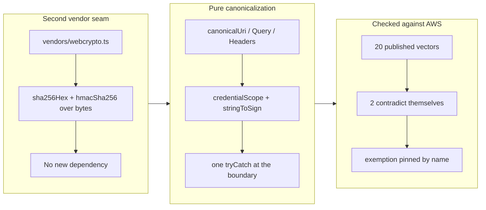

## 1. Overview

plgg-fetch can now sign an AWS request. SigV4 — canonical request, credential
scope, the four-link HMAC signing-key chain, and the `Authorization` header — is
implemented as a mostly-pure domain module over a second vendor seam that holds
the only contact with Web Crypto. No SDK, and no new dependency: hashing and
HMAC are a platform capability, not a package.

**Highlights:**

1. Verified against **AWS's own published test-suite vectors**, not against our
   own output — the canonical request byte-for-byte on all 20 cases of the
   suite's basic set.
2. Two of AWS's twenty vectors **contradict themselves**: the hash in their
   `.sts` is not the SHA-256 of the `.creq` shipped beside them. The fixture
   records that as derived data (computed with an independent hasher), the
   signature assertions apply to the other 18, and a test pins the exemption to
   exactly those two names so an implementation bug can never quietly widen it.
3. The signing chain is lifted through **one** `tryCatch` rather than threading
   a `Result` error arm through six steps — which removed five branches nothing
   could ever reach and left the package at 100% statements/lines.

## 2. Motivation

This was deferred out of the transport-core ticket on purpose: "a subtly-wrong
signer is a silent security failure, so it must not be rushed into a batch."
The failure mode is the whole point. A wrong SigV4 implementation does not
crash, does not warn, and does not degrade — it returns
`SignatureDoesNotMatch` with no indication of which of a dozen canonicalization
rules it got wrong, or worse, signs a request the caller did not mean to send.
So the ticket set its acceptance at AWS's published vectors rather than at "it
works against my account", and the work is shaped around that bar.

The wider reason is vendor-neutrality: without signing, plgg-fetch could sit in
front of a bearer-token API but not an AWS one, which privileges exactly the
providers that ship an SDK. Signing is what lets all of them sit behind the one
transport.

## 3. Changes

The shape follows the ticket's own instruction — crypto at the vendor seam, a
plgg-native signing surface in the domain — and the interesting work turned out
to be in the third box. Writing a SigV4 signer from the specification produces
something that looks right; running it against AWS's files is what found the
places where the plausible reading is the wrong one.

### 3-1. plgg-fetch: AWS SigV4 request-signing helper ([6b13fd64](https://github.com/qmu/plgg/commit/6b13fd64))

Adds `src/vendors/webcrypto.ts` (the only module touching `crypto.subtle`),
`src/domain/model/Sigv4.ts` and `src/domain/usecase/sigv4.ts`, with the
published AWS vectors as a generated fixture and a table-driven spec over them.
The public surface is `sigv4Auth` (the header `Dict` to spread), `sigv4Sign`
(the same plus the canonical request and string to sign, because AWS echoes
both in a rejection), and the pure pieces exported individually.

### 3-2. Declare the AWS vector fixture as generated, non-secret ([bea5388f](https://github.com/qmu/plgg/commit/bea5388f))

Adds `.workaholic/scan-allow` and `.gitattributes`, each naming exactly one
path. The branch-safety scan flagged the vector fixture as a credential — true
of its shape, false of its substance — and these are the repository's
sanctioned, committed, in-review declarations rather than an override. This
commit also carries an incidental 151-file corpus migration; see section 9.

## 4. Outcome

`sigv4Auth({ credentials, scope, instant, request })` returns the headers to
spread into an AWS request, and the request signs correctly by AWS's own
definition of correct. The package is at 76 passing tests and 100% statements /
100% lines / 97.56% branches / 98.04% functions against its 91% gate;
`check-all.sh` is green end to end (39 checks, exit 0).

Two deliberate limits, both documented at the call site: path normalization is
not applied (it is per-service, and S3 does not normalize — normalizing here
would corrupt S3 keys containing `.` or `//` segments), and nothing is
synthesized onto the request, because SigV4 signs the message as sent and a
header added after signing is one the signature does not cover.

## 5. Historical Analysis

The sibling ticket — GCP service-account OAuth token exchange — was split out
of the same parent for the same reason and is still queued; this branch
establishes the seam it will reuse (`vendors/webcrypto.ts` already exposes the
HMAC primitive, and RS256 signing is the same `crypto.subtle` boundary).

The pattern this branch adds to is the repository's recurring one about
*verification oracles*: an earlier branch in this corpus was written up as
"three findings each verified against the wrong oracle". A signer checked
against its own output is the purest instance of that, which is why the ticket
specified AWS's published vectors — and why discovering that two of those
vectors are internally inconsistent mattered enough to encode mechanically
rather than skip.

## 6. Concerns

### AWS's published SigV4 vectors are not all self-consistent

- **Severity:** low
- **Description:** `post-x-www-form-urlencoded` and
  `post-x-www-form-urlencoded-parameters` ship a `.sts` whose hash is not the
  SHA-256 of their own `.creq`, and the first also disagrees with itself about
  whether `content-length` is signed (see
  [6b13fd64](https://github.com/qmu/plgg/commit/6b13fd64) in
  `packages/plgg-fetch/src/domain/usecase/fixtures/sigv4Vectors.ts`). No
  implementation can satisfy both halves, so those two cases assert only the
  canonical request.
- **How to Fix:** Nothing to fix here — but the exemption must never be allowed
  to widen silently, which is why it is pinned by name in a test rather than
  expressed as a skip. If AWS republishes the suite, regenerate the fixture and
  the exemption disappears on its own.

### A read-only concern listing stages 151 renames into the next commit

- **Severity:** moderate
- **Description:** `list-open-concerns.sh` runs the feedback stream's living
  migration, which `git add`s its renames. Nothing warns, so the next `git
  commit` — even one staging two unrelated files by explicit path — carries 152
  files (see [bea5388f](https://github.com/qmu/plgg/commit/bea5388f)). This is
  the same class as the claim heartbeat committing a staged index on the
  sibling branch: a tool documented as read-only or as a no-op changes what the
  next commit contains, so a commit message ends up describing less than its
  diff. Caught and corrected here by amending the message; it would not have
  been caught by any gate.
- **How to Fix:** The migration should either commit its own renames under its
  own subject or leave them unstaged in the working tree. Both are defects in
  the `workaholic` plugin rather than in this repository, so they belong there
  via `/request` — the sanctioned cross-repository route.

### The signer trusts the caller to pass every header that will be sent

- **Severity:** moderate
- **Description:** `sigv4Sign` synthesizes nothing — not `host`, not
  `x-amz-date`. That is correct (signing what is not sent, or sending what is
  not signed, both fail) but it makes a forgotten header a runtime
  `SignatureDoesNotMatch` rather than a type error (see
  [6b13fd64](https://github.com/qmu/plgg/commit/6b13fd64) in
  `packages/plgg-fetch/src/domain/usecase/sigv4.ts`).
- **How to Fix:** A `sigv4Request(...)` builder that takes the URL plus the
  instant and *returns* the request with `host` and `x-amz-date` already on it
  would make the correct path the easy one, while leaving the raw entry for
  callers who need it. Deliberately not added here — it is API surface the
  ticket did not ask for, and it should be designed against a real calling site
  rather than guessed.

## 7. Successful Development Patterns

- **Set the acceptance at someone else's expected output.** The ticket named
  AWS's published vectors rather than "signs correctly", and that single choice
  is what caught two real bugs in this implementation before they existed: that
  duplicate header values are joined in *wire order* rather than sorted, and
  that repeated query keys sort by value. Both are the opposite of the
  plausible guess.
- **When the oracle disagrees with itself, encode the disagreement as data.**
  The two contradictory vectors could have been a skip list in the spec. Making
  `selfConsistent` a fixture field computed by an *independent* hasher means the
  fixture records a property of AWS's files rather than an opinion about our
  signer — and pinning the exempt set by name in a test means an
  implementation bug cannot hide by joining it.
- **Know where the oracle is silent.** No vector in the basic set contains
  `!`, `'`, `(`, `)` or `*`, so the suite cannot catch that
  `encodeURIComponent` is not RFC 3986. Passing 20/20 would have proved nothing
  about it; the package's own unit test covers that gap explicitly.
- **Fold a fixed-input failure mode at one boundary, not in every type.** Web
  Crypto with literal algorithm constants cannot fail, so a `Result` per step
  bought five unreachable branches and cost readability. One `tryCatch` around
  the whole chain, with the seam returning plain promises (the arrangement
  `toFetchRequest` already uses in this package), is both simpler and what the
  coverage gate rewards.

## 8. Release Preparation

**Verdict**: Ready for release

### 8-1. Concerns

- The new surface is additive: no existing export changed signature or
  behaviour, so nothing downstream can break on it.
- The signing correctness rests on AWS's published vectors, which are checked
  in and run on every suite execution rather than at release time only.

### 8-2. Pre-release Instructions

- None — standard release process applies.

### 8-3. Post-release Instructions

- None — no special post-release actions needed.

## 9. Notes

**Branch-safety scan.** The initial scan raised a **hard `secret` finding** on
the vector fixture. It was not overridden: the flagged string is
`wJalrXUtnFEMI/K7MDENG+bPxRfiCYEXAMPLEKEY`, the placeholder AWS prints in its
own public documentation and ships in its test suite, paired with the access
key id `AKIDEXAMPLE`. It authenticates nothing. The finding was cleared through
`.workaholic/scan-allow`, the scanner's own committed, reviewable
pre-declaration for "test fixtures … NOT real secrets", scoped to that one
path — so the declaration itself is in this diff for a reviewer to judge. This
is the repository's first `scan-allow` entry.

Three `size` findings remain, all `override` severity and none of them
blocking: 163 files in the diff, and two large commits. The file count and most
of the line count are the incidental corpus migration below; the rest is the
generated vector fixture, now marked `linguist-generated` in a new
`.gitattributes`.

**Incidental corpus migration.** Reading the open concerns runs the feedback
stream's idempotent living migration, which relocated 151 legacy
`.workaholic/concerns/*.md` records into `.workaholic/feedbacks/` and staged
them — so they rode into [bea5388f](https://github.com/qmu/plgg/commit/bea5388f)
alongside the two declaration files. Pure renames, no content change, not this
branch's work. The commit message was amended to say so rather than left
describing only the two files it was written for; see section 6.

This unit's effective merge policy is `review`: its ticket records no
`merge_policy`, and absent means review.

## Deployment Evidence

- **When:** 2026-08-03T21:35:24+09:00
- **By:** a@qmu.jp
- **Target:** release-scan
- **Method:** override
- **Status:** bypassed
- **Observed:** size findings overridden on the developer's explicit merge instruction; hard count 0 (the AWS vector fixture's credential-shaped strings are declared in .workaholic/scan-allow).

## Deployment Evidence

- **When:** 2026-08-03T21:35:24+09:00
- **By:** a@qmu.jp
- **Target:** plgg guide (plggpress docs site)
- **Method:** api-probe
- **Status:** pass
- **Observed:** Pre-merge readiness per the guide deployment contract: scripts/check-all.sh green end to end (39 checks, exit 0) on the branch AFTER catching up with main (merge 2d084b7b), so the proven tree equals what merges.
