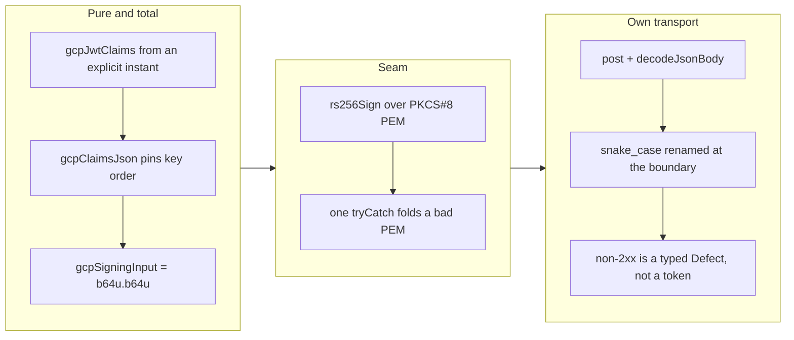

## 1. Overview

plgg-fetch can now turn a GCP service account into an access token. The
JWT-bearer flow — build the claims, sign the assertion RS256, POST it to
Google's token endpoint — is a domain module over the package's Web Crypto
seam, and the exchange itself rides this package's own `post` +
`decodeJsonBody`. No vendor SDK, no new dependency, and no raw `fetch`
anywhere in it.

**Highlights:**

1. RS256 is verified against **Node's `crypto`** — an implementation entirely
   independent of the Web Crypto path under test — over a key pair generated
   fresh per run. Nothing is committed, and RS256's determinism makes the
   comparison an interoperability proof rather than a self-consistency one.
2. The claims JSON is written explicitly rather than through `encodeJson`,
   because a JWT signature covers *bytes*: the key order has to be pinned by
   the code, and the serializer's `Result` would have threaded an unreachable
   error arm through the entire signing path.
3. A hard secret finding was raised on the **production** vendor file and was
   fixed at the source rather than allowlisted — a doc comment had spelled out
   the PEM armour line verbatim. Only the spec, which cannot avoid the OAuth
   wire vocabulary, ends up declared.

## 2. Motivation

This is the second of the two crypto-bearing auth families deferred out of the
transport-core ticket — the sibling of AWS SigV4, split for the same reason:
each needs a careful, correctly-tested implementation rather than a place in a
batch. Together they complete the claim vendor-neutrality actually rests on. A
transport that can reach a bearer-token API but needs an SDK for Google and
another for AWS has not removed the vendor dependency, it has just moved it;
signing and token exchange are what let every provider sit behind the same
typed transport.

## 3. Changes

Everything below the transport is a pure function of its inputs — the clock
included, since `issuedAtSeconds` is a parameter rather than a read inside the
helper. That is what makes a whole signing input comparable against a fixed
expected string, and it is the same shape the SigV4 sibling arrived at with its
`Sigv4Instant`.

### 3-1. plgg-fetch: GCP service-account OAuth token exchange ([bf7fb8a1](https://github.com/qmu/plgg/commit/bf7fb8a1))

Adds `src/domain/model/GcpOAuth.ts`, `src/domain/usecase/gcpOAuth.ts` and the
RS256 half of `src/vendors/webcrypto.ts`, with `gcpAccessToken` as the one-call
entry and every step exported separately (a failed exchange is usually a wrong
claim, so the steps have to be individually checkable).

### 3-2. Drop credential-shaped strings from GCP sources ([a61f3f50](https://github.com/qmu/plgg/commit/a61f3f50))

Reworded the two false-positive sites that were fixable at the source: the doc
comment in the production vendor file, and the stub token that used `ya29.`,
Google's real access-token prefix.

### 3-3. Declare the GCP OAuth spec as credential-shaped ([07bed912](https://github.com/qmu/plgg/commit/07bed912))

Adds `.workaholic/scan-allow` naming only the spec, whose OAuth vocabulary is
credential-shaped by construction.

## 4. Outcome

`gcpAccessToken(account, request, issuedAtSeconds)` returns a typed token, and
`gcpBearerAuth` turns it into an `Authorization` header. 55 package tests pass,
including the RS256 signature matching Node's `crypto` byte-for-byte, the RFC
7523 form body captured off a stubbed `fetch`, and each failure path (malformed
PEM, a 400 from the endpoint, a transport throw) folding to a `Defect`.
Coverage is 100% statements / 100% lines / 97.22% branches / 97.59% functions
against a 91% gate, and `check-all.sh` is green end to end (39 checks, exit 0).

## 5. Historical Analysis

The immediately relevant history is the SigV4 sibling on PR #97, driven in the
same run. Both were split out of
`20260719043544-plgg-fetch-auth-streaming-timeout-multipart-binary` with the
same instruction — do not rush a signer into a batch — and both converged
independently on the same three shapes: the clock as a parameter, one
`tryCatch` at the boundary instead of a `Result` per step, and an *independent*
oracle rather than a recorded expectation. That convergence is the useful
signal: they are the right shapes for signing code in this codebase, not
one-off choices.

## 6. Concerns

### This branch and PR #97 both create vendors/webcrypto.ts and .workaholic/scan-allow

- **Severity:** moderate
- **Description:** Both were cut from `main` as separate PR-units, and each
  needed the Web Crypto seam. Whichever merges second hits a content conflict
  on `packages/plgg-fetch/src/vendors/webcrypto.ts` (see
  [bf7fb8a1](https://github.com/qmu/plgg/commit/bf7fb8a1)) and on
  `.workaholic/scan-allow`.
- **How to Fix:** Merge #97 first, then rebase this branch; both conflicts are
  mechanical and the resolution is the **union** in each case —
  `sha256Hex`/`hmacSha256` from SigV4 plus `rs256Sign`/`toBase64Url`/`pemToDer`
  from here, sharing the one `utf8Bytes`, and both `scan-allow` entries. This
  is a cost of the partition, not of either implementation: the parent ticket's
  "must not be rushed into a batch" was honoured at the PR-unit level, and that
  is what produced the overlap.

### A caller with a skewed clock gets a remote rejection, not a local error

- **Severity:** low
- **Description:** `issuedAtSeconds` is supplied by the caller, deliberately —
  it is what makes every step below the transport pure and testable. The cost
  is that a clock more than a few minutes off produces an assertion Google
  rejects, surfacing as a 400 rather than as anything local (see
  [bf7fb8a1](https://github.com/qmu/plgg/commit/bf7fb8a1) in
  `packages/plgg-fetch/src/domain/usecase/gcpOAuth.ts`).
- **How to Fix:** Nothing in the library — inventing a clock check would
  reintroduce exactly the impurity the parameter removes. The 400's message is
  carried into the `Defect`, so the diagnosis is available; if this bites in
  practice, the fix belongs in a caller-side helper that reads the clock once.

### The scanner's credential rule fires on the OAuth wire vocabulary

- **Severity:** low
- **Description:** `access_token`, `token_type` and `Bearer` beside string
  values are a credential shape to the branch-safety scan, and an OAuth spec
  cannot avoid them (see
  [07bed912](https://github.com/qmu/plgg/commit/07bed912)). Renaming the stub
  values did not help — the field names are the trigger.
- **How to Fix:** Declared narrowly in `.workaholic/scan-allow` rather than
  overridden. Worth noting for the next OAuth-shaped test in any package: try
  the source fix first (it removed the *production*-file finding here), and
  declare only the file the wire format forces.

## 7. Successful Development Patterns

- **Prefer an independent implementation to a recorded expectation.** The
  obvious test — a committed fixture key plus an expected assertion — commits a
  real private key and compares our output to our own. Generating a throwaway
  key pair per run and checking against Node's `crypto` costs milliseconds,
  commits nothing, and proves interoperability. Any deterministic signature
  algorithm can be tested this way when a second implementation is already on
  the machine.
- **An unreachable error arm means the fallible API is the wrong tool.** The
  reflex is to test the branch or to exclude it from coverage. Writing the
  claims JSON explicitly removed the arm entirely *and* pinned the key order
  that a JWT signature depends on — the constraint and the coverage problem had
  the same answer.
- **Fix a scanner false positive at its source before declaring it, and
  especially in production code.** Two of three sites here were reworded away.
  What that buys is not tidiness: an allowlisted production file is a place a
  genuine key could later hide unreported.
- **Move the clock to the call site.** Both signing implementations in this run
  independently ended up taking the instant as a parameter, which is what made
  a whole signing input comparable against a fixed string.

## 8. Release Preparation

**Verdict**: Ready for release

### 8-1. Concerns

- Additive surface only: no existing export changed signature or behaviour.
- The branch conflicts with PR #97 on two files if merged second — see section
  6. That is a merge-order note, not a release blocker.

### 8-2. Pre-release Instructions

- None — standard release process applies.

### 8-3. Post-release Instructions

- None — no special post-release actions needed.

## 9. Notes

**Branch-safety scan.** Five hard `secret` findings were raised and none was
overridden. Four were fixed at the source (the production vendor file's doc
comment, and the `ya29.` stub token prefix); the fifth is the OAuth wire
vocabulary in the spec, declared in `.workaholic/scan-allow`. No key material
is committed anywhere on this branch — the RSA key pair the spec signs with is
generated at run time by `node:crypto`. One `size` finding remains
(1067 changed lines on the implementation commit), `override` severity and
folded in here rather than acted on.

This unit's effective merge policy is `review`: its ticket records no
`merge_policy`, and absent means review.

## Deployment Evidence

- **When:** 2026-08-03T21:43:36+09:00
- **By:** a@qmu.jp
- **Target:** release-scan
- **Method:** override
- **Status:** bypassed
- **Observed:** size findings overridden on the developer's explicit merge instruction; hard count 0 (the GCP OAuth spec's wire vocabulary is declared in .workaholic/scan-allow, and no key material is committed -- the RSA pair is generated per run).

## Deployment Evidence

- **When:** 2026-08-03T21:43:36+09:00
- **By:** a@qmu.jp
- **Target:** plgg guide (plggpress docs site)
- **Method:** api-probe
- **Status:** pass
- **Observed:** Pre-merge readiness per the guide deployment contract: scripts/check-all.sh green end to end (39 checks, exit 0) on the branch AFTER catching up with main including PR 97 (merge 0b4549a5), whose vendors/webcrypto.ts, plgg-fetch barrels, README and scan-allow conflicts were resolved as the union of both signing families. plgg-fetch 88 tests pass on the merged seam.
