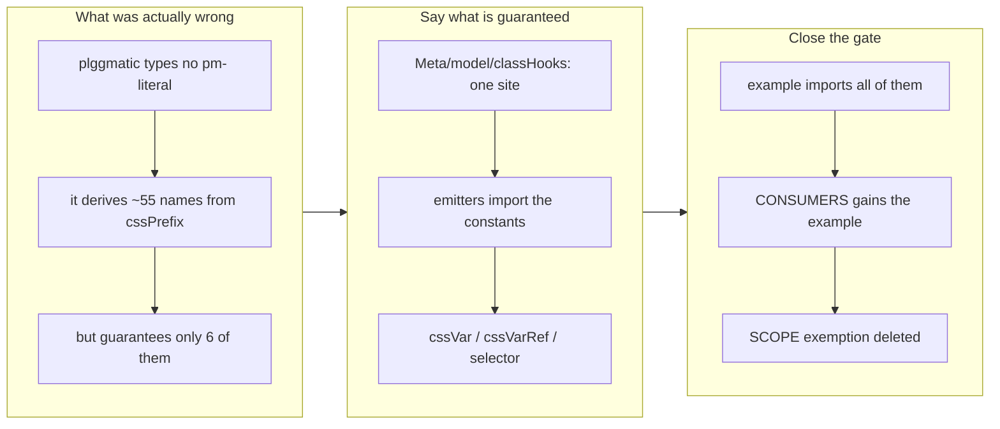

## 1. Overview

Every class hook plggmatic emits is now a named export, and the framework's own
demo app is under the gate that forbids typing one. The exemption that used to
sit in `scripts/gate-framework-names.sh` is gone from the file, not widened —
it existed because the framework was incomplete, and completing it was the
work.

**Highlights:**

1. `Meta/model/classHooks.ts` is the single definition site for all ~55 hooks,
   plus `cssVar`/`cssVarRef` for the `--pm-*` custom properties and `selector()`
   for writing a hook as a CSS rule. The emitters import from it, so "the
   framework renders it" and "the framework guarantees it" are one fact.
2. The example app's 84 typed `pm-` literals are gone, across 14 files.
3. The acceptance's own verification method stopped working — after the change
   the bundle contains **zero** `pm-` literals, because every hook is composed
   from `cssPrefix` at runtime. Verified against the *rendered* names instead.

## 2. Motivation

The gate's SCOPE comment was honest about why the demo was excluded: it typed
component hooks *the framework did not export at all* — `pm-btn`, `pm-dialog`,
`pm-toast-*` — so "adding it here would only make the gate a thing to disable."
That is the shape worth noticing: an exemption whose stated reason is a gap in
the thing being enforced. The demo could not import what did not exist, so the
fix had to be a framework change first and a consumer change second.

The underlying risk is the one the gate was built for. A consumer that types
`pm-pane` has a cross-package contract no compiler checks: rename `cssPrefix`
upstream and the consumer keeps compiling while its pages quietly lose their
styling. The framework's own reference app was the least-guarded consumer of
all.

## 3. Changes

The framework turned out to be clean already — it never typed a `pm-` literal,
it composed every name from `cssPrefix`. What it lacked was anywhere to state
which of those composed names it stands behind. That is the whole change: not
new behaviour, but the difference between a name that happens to be rendered
and a name that is promised.

### 3-1. Export every plggmatic class hook ([6cc608df](https://github.com/qmu/plgg/commit/6cc608df))

Adds `packages/plggmatic/src/Meta/model/classHooks.ts` as the single definition
site, re-points the two existing hook homes (`Layout/usecase/combinators`,
`Component/usecase/themeToggle`) at it so no hook has two definitions, rewrites
13 emitter modules to import the constants instead of composing inline, exports
the lot from the package root, replaces all 84 typed literals across 14 example
files, and adds `packages/plggmatic-example/src` to the gate's `CONSUMERS` while
deleting the SCOPE paragraph that excluded it.

## 4. Outcome

`./scripts/gate-framework-names.sh` reports "no consumer types a plggmatic
name" with the example in scope. plggmatic's 349 tests and the example's 56 are
green, plggmatic's coverage is 99.59% statements / 91.30% branches / 93.18%
functions / 99.59% lines against its 90% gate, and `check-all.sh` is green end
to end (39 checks, exit 0).

The rename-safety claim was checked by actually renaming: with `cssPrefix` set
to `zz` and plggmatic's dist rebuilt, the example rendered `zz-board`,
`.zz-board` and `var(--zz-surface)` — with all 57 example tests still passing
and not one file edited to make that happen. That is the property the ticket
wanted, demonstrated rather than asserted.

## 5. Historical Analysis

This is the second half of a pair from the
`make-the-column-strip-a-real-navigation-surface` mission. Ticket
`20260728091000` retired the `pm-` class coupling in plggpress and built the
gate; it scoped itself to one consumer and wrote down exactly why the other was
excluded, naming this ticket as the follow-up. The same sequencing paid off as
it did for the `relocate.mjs` pair driven earlier in this run: prove the shape
on one consumer, then apply it — and discover on the second pass what the first
could not see. Here that was the `--pm-*` custom properties, which the plggpress
migration never had to confront because plggpress does not write its own
stylesheets against the framework's colour tokens.

## 6. Concerns

### The gate cannot tell a rendered string from a typed class name

- **Severity:** low
- **Description:** The gate fails any `pm-` occurrence in consumer code outside
  a comment, which correctly caught a *rendered prose* string in
  `demo2/colorSchemeDemo.ts` describing the `--pm-*` namespace to the reader
  (see [6cc608df](https://github.com/qmu/plgg/commit/6cc608df)). It is page
  copy, not a contract.
- **How to Fix:** Left composing `cssVarRef("*")`, which is arguably the better
  answer — the sentence now follows a rename like everything else — but it does
  mean user-visible copy participates in a refactor, and a future consumer may
  reasonably want prose that just says `pm-`. If that recurs, the gate's comment
  filter is the place to extend, not the copy.

### The example app has no coverage floor to guard the rewrite

- **Severity:** low
- **Description:** 14 files were rewritten mechanically, and
  `plggmatic-example` is coverage-EXEMPT (private demo app), so only its 56
  tests stand behind the change (see
  [6cc608df](https://github.com/qmu/plgg/commit/6cc608df) in
  `packages/plggmatic-example/plgg-test.config.json`).
- **How to Fix:** The prefix-flip check compensates for exactly the failure mode
  that matters here — a missed literal would NOT have followed `cssPrefix` to
  `zz`, and the gate independently proves no literal remains. Worth re-running
  the flip if the demo grows new stylesheets.

### A hook constant and its emitter can still drift in one direction

- **Severity:** low
- **Description:** The emitters now import the constants, so a renamed hook
  changes both together. But nothing forces a NEW hook to be added to
  `classHooks.ts` — an emitter that composes `${cssPrefix}-newthing` inline
  would render a name no consumer can import, recreating the original gap one
  hook at a time (see
  [6cc608df](https://github.com/qmu/plgg/commit/6cc608df) in
  `packages/plggmatic/src/Meta/model/classHooks.ts`).
- **How to Fix:** A gate over `packages/plggmatic/src` that fails on
  `${cssPrefix}-` outside `classHooks.ts` would close it mechanically — the
  same trick as the consumer gate, pointed inward. Deliberately not added here:
  it is a new gate, not this ticket's scope, and it wants its own ticket.

## 7. Successful Development Patterns

- **When an exemption's stated reason is a gap, fix the gap.** The gate's own
  comment said the demo was excluded because the framework did not export what
  it needed. That sentence was the specification for this ticket — a scope note
  that explains itself is worth more than one that just names a boundary.
- **Verify the property, not the artifact.** The acceptance said to grep the
  build output, and after the change that grep finds nothing at all — a passing
  result for entirely the wrong reason. Renaming `cssPrefix` and observing the
  rendered names change is the check that actually distinguishes success from
  a silently broken consumer.
- **Export the whole contract, not the visible half.** Class hooks are the
  obvious surface; the `--pm-*` custom properties are the other half, spelled
  about forty times across the demo's stylesheets. Shipping `cssVar`/`cssVarRef`
  alongside the hooks was what made the gate satisfiable without rewording every
  stylesheet.
- **Restore prose after a mechanical pass.** A blind rewrite touches comments
  too, where an interpolation is both inert and unreadable. Reverting the
  comment-only rewrites kept the documentation saying `pm-row` plainly, which is
  what the gate's "PROSE IS FINE" rule intends.

## 8. Release Preparation

**Verdict**: Ready for release

### 8-1. Concerns

- plggmatic publishes to npm from this repo, and this change is **additive** to
  its public surface: ~60 new named exports, no existing export changed
  signature or value. Consumers on the current version are unaffected.
- The rendered DOM is byte-identical — the hooks resolve to exactly the strings
  they did before, which the 349 + 56 passing tests and the unchanged demo
  build confirm.

### 8-2. Pre-release Instructions

- None — standard release process applies.

### 8-3. Post-release Instructions

- None — no special post-release actions needed.

## 9. Notes

The branch-safety scan reports one `size` finding (1431 non-generated changed
lines on the implementation commit), `override` severity and not acted on. The
bulk is the 84-literal replacement across 14 example files plus the new
definition module; splitting it would separate the framework's exports from the
consumer's imports of them, which is precisely the pair that has to land
together for the gate to pass.

This unit's effective merge policy is `review`: its ticket records no
`merge_policy`, and absent means review.

## Deployment Evidence

- **When:** 2026-08-03T21:49:07+09:00
- **By:** a@qmu.jp
- **Target:** release-scan
- **Method:** override
- **Status:** bypassed
- **Observed:** size findings overridden on the developer's explicit merge instruction; hard count 0.

## Deployment Evidence

- **When:** 2026-08-03T21:49:07+09:00
- **By:** a@qmu.jp
- **Target:** plgg guide (plggpress docs site)
- **Method:** api-probe
- **Status:** pass
- **Observed:** Pre-merge readiness per the guide deployment contract: scripts/check-all.sh green end to end (39 checks, exit 0) on the branch AFTER catching up with main through PR 98 (merge 3298785c). An earlier run of this proof failed at the plgg-ir-manifest build; it was a shared-dist concurrency flake from a prior run being killed mid-build on the same worktree, reproduced-clean by rebuilding that package alone and then by this full green run.
