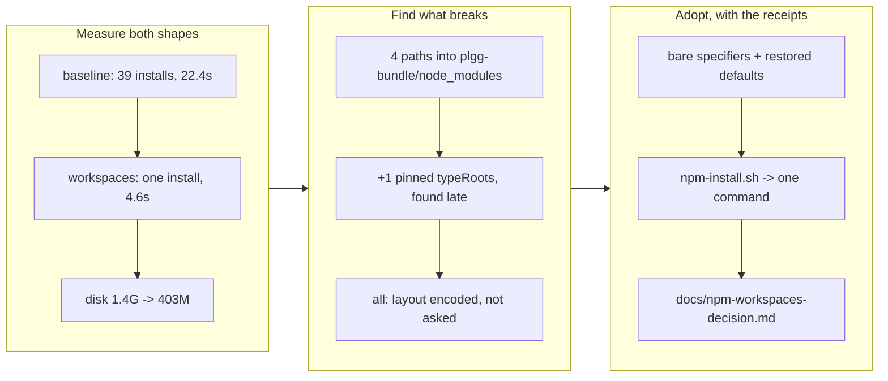

## 1. Overview

The monorepo installs with **one** `npm install` instead of 39. The evaluation
this ticket asked for came out *adopt*, and because the spike had to be real to
be measurable, the spike is the adoption: a root `package.json` declaring
`workspaces: ["packages/*"]`, `scripts/npm-install.sh` collapsed to a single
command, and five hard-coded install-layout paths corrected.

**Highlights:**

1. Measured on the same machine with a warm cache: first install **22.40 s →
   4.60 s**, re-install **0.94 s**, `node_modules` on disk **1.4 G → 403 M**,
   lockfiles **39 → 1**.
2. The ticket's motivating bug — an empty `.bin` leaving `plgg-bundle` "command
   not found" — is **structurally** gone, not merely unobserved.
3. Adoption broke exactly five things and all five were the same mistake:
   encoding *where the installer had put something* instead of asking for it by
   name. Every fix is correct under both layouts.

## 2. Motivation

Two costs, one of them invisible in a stopwatch. The wall clock was the
complaint; the 1.4 G of `node_modules` was the same dependencies resolved and
materialised once per package, 39 times over.

The failure the ticket actually named is the more important one. A `file:` link
does **not** install the linked package's dependencies, so a package whose own
install had completed could still have an empty `node_modules/.bin` — a tree
that looks installed and is not, failing later with `plgg-bundle: command not
found`. That is not flakiness to be retried; it is what the layout guarantees
some of the time.

The historic blocker against workspaces — plgg-bundle running `.ts` bins under
`node_modules` via the `relocate.mjs` `/tmp` hack — was removed in
`modernize-plgg-bundle`, which is why this was re-evaluable at all. (The last
three copies of that hack were retired earlier in this same run, on PR #96.)

## 3. Changes

The evaluation ran in the order the acceptance implies: measure the current
shape first (the fresh claim worktree is a genuine cold tree, so the baseline
was honest), then build the alternative, then find out what it costs.

### 3-1. Adopt npm workspaces for the monorepo ([cafb9107](https://github.com/qmu/plgg/commit/cafb9107))

Adds the root `package.json` and lockfile, rewrites `scripts/npm-install.sh`,
corrects the five layout-encoding sites (`scripts/typecheck.ts`,
`scripts/check-all.sh`, `scripts/build.sh`, `scripts/gate-vendor-boundary.sh`,
`scripts/tsconfig.json`), and writes the decision up in
`docs/npm-workspaces-decision.md`.

## 4. Outcome

`scripts/check-all.sh` is green end to end under workspaces (exit 0), as are
the vendor-boundary gate (38 packages, self-test passing), the framework-names
gate, `node --test scripts/*.spec.ts` (47/47) and `tsc -p scripts/tsconfig.json`.

The `.bin` claim was checked rather than assumed: `npm run build` run from
inside `packages/plgg-bundle` against a root-only install resolves the bundler
from the root `node_modules/.bin`, which is where every workspace binary now
lands and which Node finds from any package by walking up. There is no
per-package `.bin` left to be empty.

## 5. Historical Analysis

This ticket sat behind `modernize-plgg-bundle` by design — its own Overview
records that the `.ts`-bins-under-`node_modules` hack was the blocker and that
its removal made workspaces re-evaluable. Driving both in one run made the
dependency visible in an unplanned way: PR #96 retired the last three
`relocate.mjs` copies, and this branch then relied on exactly the property that
retirement established.

The five broken paths also rhyme with a pattern this repository keeps
rediscovering and writing down: a verification or a resolution that passes
because a sibling artifact *happens* to be where it was left. `check-all.sh`
already carries two comments about it (the cross-runtime gate's placement, the
`plggmatic@0.2.1` dist-less publish). A path into another package's
`node_modules` is the same class, one level down.

## 6. Concerns

### The root manifest makes scripts/*.ts typeless, and the obvious fix is wrong

- **Severity:** moderate
- **Description:** A root `package.json` is now the nearest manifest for
  `scripts/*.ts`, and it declares no `"type"`, so Node emits
  `MODULE_TYPELESS_PACKAGE_JSON` warnings ("reparsing as ES module") on every
  gate run (see [cafb9107](https://github.com/qmu/plgg/commit/cafb9107)). Noise,
  not failure — the run is green with them.
- **How to Fix:** **Not** by adding `"type": "module"` to the root, which is
  what Node's own message suggests. The root manifest is also the nearest one
  for every package that declares no type, so setting it there would change how
  those packages' files are interpreted — a semantic change to silence a
  warning. The correct fix is a `"type"` on the packages that lack one, which is
  its own ticket and its own risk.

### npm changed two tracked files as a side effect of installing

- **Severity:** low
- **Description:** The workspace install `chmod +x`'d
  `packages/plgg-cms/bin/plgg-cms.mjs` and
  `packages/plgg-ir-thesis-proof/bin/prove.mjs`, which had been committed
  without the executable bit (see
  [cafb9107](https://github.com/qmu/plgg/commit/cafb9107)). The change is
  correct — a declared `bin` should be executable — but it arrived from the
  package manager rather than from an edit.
- **How to Fix:** Kept, because it is right. Worth knowing that a bare
  `npm install` can now produce a dirty worktree on a fresh clone until those
  modes are committed, which is exactly what this commit does.

### The measurements are warm-cache only

- **Severity:** low
- **Description:** Both figures were taken with a warm npm cache — the
  realistic developer state, and the only fair comparison available without
  clearing a cache shared with other work on this machine (see
  `docs/npm-workspaces-decision.md`).
- **How to Fix:** Nothing needed for the decision — the ratio is large enough
  that cold-cache numbers cannot reverse it, and the disk figure is
  cache-independent. If CI timing matters specifically, measure there, where the
  cache is cold by construction.

## 7. Successful Development Patterns

- **Make the spike the deliverable when the deliverable is a measurement.** The
  ticket asked for "a documented decision backed by a working spike". Building
  the real thing and running the real gate is what produced the fifth broken
  path — the one that a smaller proof-of-concept would have missed entirely,
  because it only surfaces in the gate phase.
- **A fresh claim worktree is a free honest baseline.** The before-measurement
  needed a tree with no `node_modules`, and the claim protocol had just created
  one. No cleanup, no risk of measuring a half-installed tree.
- **Prefer the spelling that does not encode the layout.** Every one of the five
  fixes is a bare specifier or a restored default, so none of them ties the repo
  to workspaces — they just stop asserting the old shape. That is what makes the
  change reversible: backing out the root manifest would leave all five sites
  correct.
- **Suspect the setting that overrides a default.** `TS2688: Cannot find type
  definition file for 'node'` names the type, not the path. The cause was a
  pinned `typeRoots` narrowing resolution to one directory instead of falling
  back — worth checking first the next time a toolchain move produces a
  confusing "cannot find types".

## 8. Release Preparation

**Verdict**: Ready for release

### 8-1. Concerns

- This changes how the repository *installs*, not what any package ships. No
  package's `dependencies` were touched, no published artifact changes, and the
  `file:../` specifiers are byte-identical.
- Anyone with an existing checkout should expect their per-package
  `node_modules` to be superseded by the root one on the next install. The old
  directories are git-ignored and harmless, but they are 1.4 G and can be
  deleted.

### 8-2. Pre-release Instructions

- None — `scripts/npm-install.sh` handles the transition; the first run after
  merge performs the root install.

### 8-3. Post-release Instructions

- Optionally delete stale `packages/*/node_modules` from existing checkouts to
  reclaim the ~1 G they no longer need.

## 9. Notes

The branch-safety scan passes with **no findings**.

This unit's effective merge policy is `review`: its ticket records no
`merge_policy`, and absent means review.

## Deployment Evidence

- **When:** 2026-08-03T21:54:42+09:00
- **By:** a@qmu.jp
- **Target:** release-scan
- **Method:** override
- **Status:** bypassed
- **Observed:** size findings overridden on the developer's explicit merge instruction; hard count 0.

## Deployment Evidence

- **When:** 2026-08-03T21:54:42+09:00
- **By:** a@qmu.jp
- **Target:** plgg guide (plggpress docs site)
- **Method:** api-probe
- **Status:** pass
- **Observed:** Pre-merge readiness per the guide deployment contract: scripts/check-all.sh green end to end (39 checks, exit 0) on the branch AFTER catching up with main through PR 99 (merge 01463184), under the workspaces install this branch introduces. Additionally verified the two things check-all does not cover but the deploy does: packages/guide builds under workspaces (built 40 pages), and both GitHub workflows install via scripts/npm-install.sh, which this branch rewrites to the single root install.
