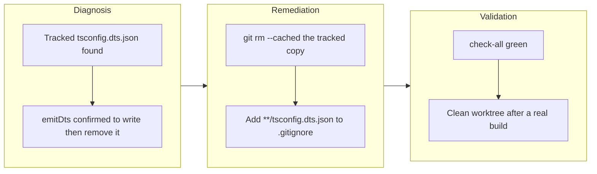

## 1. Overview

`packages/plgg-ir-manifest/tsconfig.dts.json` was tracked in git even though plgg-bundle's `emitDts` writes it, runs `tsc` against it, and removes it on every declaration build. The branch untracks that copy and adds a repository-wide ignore rule for the filename, so building a library package no longer leaves a deleted tracked file behind.

**Highlights:**

1. Removed the tracked copy of the generated `tsconfig.dts.json` from `packages/plgg-ir-manifest` — the only one among 37 library target packages
2. Added `**/tsconfig.dts.json` to `.gitignore` beside plgg-bundle's other transient artifacts (`dist.stage/`, `dist.old/`)
3. Spelled the pattern in full rather than as a `tsconfig*` wildcard, so `tsconfig.json` and `tsconfig.build.json` stay tracked

## 2. Motivation

A build that dirties the worktree is not a cosmetic problem in this repository, because several gates read worktree cleanliness as a fact about the developer's work. Building `plgg-ir-manifest` left ` D packages/plgg-ir-manifest/tsconfig.dts.json` in `git status`, and from there `/drive`'s claim teardown refused to remove the worktree (`{"error": "worktree has uncommitted changes; not removed"}`), while `/ship` and `/report` reported it as uncommitted work — work that belonged to nobody. The fix stays deliberately narrow: `emitDts`'s write-then-remove lifecycle is correct and untouched, and only the tracking state changes. The ignore pattern is `**/`-scoped rather than pinned to the one package, because every library target generates the same temporary file and a one-package rule would merely postpone the next recurrence.

The generated file belongs to the same family of plgg-bundle temporaries (`dist.stage/`, `dist.old/`) that `.gitignore` already covered; it appears to have been mixed into a larger change and overlooked when those were registered.

## 3. Changes

The work started from a failure already observed in a previous run — a claim worktree that could not be torn down — and traced it to a generated file under version control. `emitDts` was read to confirm the lifecycle rather than assumed, the tracked copy was dropped with `git rm --cached`, and the ignore rule was scoped to every package. Verification ran the package build on the committed tree and checked that `git status --porcelain` came back empty while `dist/index.d.ts` was still emitted.

### 3-1. 生成物 tsconfig.dts.json が追跡されていて、ビルドのたびに worktree が汚れる ([b8f94765](https://github.com/qmu/plgg/commit/b8f94765))

Untracked `packages/plgg-ir-manifest/tsconfig.dts.json` with `git rm --cached` and added `**/tsconfig.dts.json` to `.gitignore` with a comment naming `emitDts` as the writer. `emitDts.ts` itself is unchanged — the defect was the tracking state, not the build behavior.

## 4. Outcome

Building `packages/plgg-ir-manifest` on the committed tree leaves `git status --porcelain` empty, and `dist/index.d.ts` is still emitted, so declaration generation is intact. No tracked `tsconfig.dts.json` remains anywhere (`git ls-files | grep -F tsconfig.dts.json` returns nothing), and the same check finds no stray `dist.stage/` or `dist.old/` either. The new rule ignores only the generated file: `git check-ignore -v` exits 1 for both `packages/plgg-ir-manifest/tsconfig.json` and `packages/plgg-auth/tsconfig.build.json`. `./scripts/check-all.sh` is green (exit 0, 39 checks including typecheck), which is what proves declaration generation across every library package was not disturbed.

## Deployment Evidence

- **When:** 2026-08-03T22:30:12+09:00
- **By:** a@qmu.jp
- **Target:** plgg guide (plggpress docs site)
- **Method:** api-probe (pre-merge readiness)
- **Status:** pass
- **Observed:** scripts/check-all.sh exit 0 on the branch tip: 39 checks green including typecheck; npm preflight reports nothing to publish (no package version bumped)
