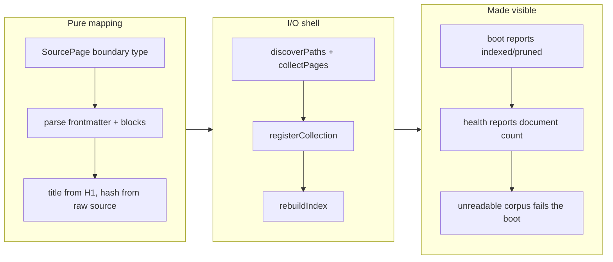

## 1. Overview

`plgg-cms serve` mounted a working MCP server whose every tool returned nothing: `openIndex` created the schema, and no code anywhere wrote a row into it. This branch adds the missing step — a corpus reader that turns a plggpress content directory into index inputs, run at serve boot — so `search_content`, `get_article` and `list_collections` answer over the documentation the same instance renders.

**Highlights:**

1. A pure corpus mapping (`indexInputsOf`) plus the I/O shell over it (`ingestCorpus`), wired into the one place every downstream reader shares
2. `collectPages` and `rawHtmlOf` published from plggpress, so the derived index is built by the SSG's own reader rather than a second corpus walker
3. `healthWeb` now reports the indexed document count, making "serving, but with nothing indexed" visible from outside
4. A corpus that will not read or parse fails the boot instead of quietly serving an empty index

## 2. Motivation

The gap was not a defect discovered here; it was a known, named, unbuilt step. Archived ticket 16's Final Report says so directly — *"populating the served index needs an async build step the current sync `(paths) => Web` serve seam cannot host — that live serve-lifecycle ingest is the one remaining integration"* — and its Implementation Steps 8 and 9 specified the artifact and its call site. Four later tickets (21 requests/comments, 24 RAG, 25 voice agent, 30 plugin export) were then written against that ingester as an *existing* extension point. It was never written, so all of them rest on an index nobody fills.

The blocker that justified the deferral had since expired. `pressServeWebWithAuth` is now an async seam returning `PromisedResult`, it already awaits `openIndex`, and it already receives both `contentDir` and `config` — the exact two inputs an ingester needs. Reading the code before re-litigating the design turned a serve-lifecycle question into a drop-in call site.

The failure mode is worth naming, because it is what let this sit unnoticed: an unfilled index answers every query correctly and emptily, which is indistinguishable from a corpus that genuinely says nothing. `GET /health` passed, `tools/list` was complete, and each `tools/call` returned a well-formed `[]`. Only a reader who expected content could tell.

## 3. Changes

The work split along the side-effect seam the house style asks for: everything worth testing (a page with no H1, a page with no fence, a malformed fence, a frontmatter-only edit changing the hash, raw-HTML parity) lives in a pure function over in-memory pages, while the shell only reads files and hands the result to the existing `rebuildIndex`. Publishing `collectPages` from plggpress was preferred over reimplementing the route→file inverse in plgg-cms, which the codebase already warns against duplicating.

### 3-1. 配信インスタンスの `/mcp` が空を返す — Markdown コーパスを content index に取り込む経路が存在しない ([12a230bb](https://github.com/qmu/plgg/commit/12a230bb))

Added `indexInputsOf` (pure: source pages → `IndexInput[]`) and `ingestCorpus` (the shell: discover, read, register the collection, rebuild), called from `pressServeWebWithAuth` right where the index is opened. `healthWeb` reports the document count; `ROLLOUT.md`'s claim that the empty index was deferred *config* is corrected to what it was, a missing code path; `agent-surfaces.md` gains the startup command and the actual (unguarded) auth posture it never documented.

## 4. Outcome

Booted from `packages/guide`, the instance prints `indexed 39 page(s), pruned 0` before serving, and `GET /health` returns `{"status":"ok","documents":39}`. Over `POST /mcp` with no `Authorization` header: `list_collections` returns `["content"]`; `search_content` for `plggpress` returns `/packages/plggpress/` with the heading breadcrumb `plggpress > Authoring`; and `get_article` with that collection and path returns the document. The search-then-fetch round trip an agent must make now closes.

`./scripts/check-all.sh` is green (39 checks, exit 0) and plgg-cms coverage clears all four metrics — statements 98.85%, branches 93.96%, functions 94.98%, lines 98.85%.

## 5. Concerns

### The documented `/mcp` auth posture still does not match what ships

- **Severity:** moderate
- **Description:** `agent-surfaces.md` describes `/mcp` as an OAuth 2.1 resource server separating `plggpress:read` from `plggpress:write` scopes, but `pressServer.ts` mounts the unguarded `mcpWeb`, and `mcpWebGuarded` has no caller outside its own spec (see [12a230bb](https://github.com/qmu/plgg/commit/12a230bb) in `packages/plgg-cms/src/mcp/mcpWeb.ts`). This branch documented the gap rather than closing it, because the read tools are genuinely public by the progressive-lighting decision and there are no write tools registered to gate. It becomes real the moment a write tool is added.
- **How to Fix:** Either wire `mcpWebGuarded` with a `resolveWrite` bearer→scope check before the first write tool is registered, or amend the roadmap text so the guarded variant is documented as unbuilt rather than as shipped.

### The index is rebuilt in full on every boot, with no incremental path

- **Severity:** low
- **Description:** `ingestCorpus` reads and parses the whole corpus at startup. At 39 pages this is imperceptible, but the cost is linear in corpus size and paid on every restart, and `indexDocument`'s content-hash skip cannot help because an in-memory index starts empty (see [12a230bb](https://github.com/qmu/plgg/commit/12a230bb) in `packages/plgg-cms/src/content/Ingest/usecase/ingestCorpus.ts`). Ticket 16's Considerations already parked the remedy.
- **How to Fix:** If startup time becomes a problem, persist the index to a path and diff by `contentHash` at boot — the hash comparison is already implemented, so only the storage seam is missing.

### A single unparseable page fails the whole boot

- **Severity:** low
- **Description:** `indexInputsOf` short-circuits on the first page it cannot parse, and the serve seam turns that into a failed boot. This is deliberate — a partially-indexed corpus is the silent state this ticket exists to remove — but it means one malformed frontmatter fence anywhere takes the instance down rather than degrading (see [12a230bb](https://github.com/qmu/plgg/commit/12a230bb) in `packages/plgg-cms/src/content/Ingest/usecase/indexInputsOf.ts`).
- **How to Fix:** If an operator needs the instance to survive a bad page, report the failures as data (a per-page outcome list) and let the caller decide whether to boot; do not silently skip, which would reintroduce the invisible under-reporting.

## 6. Successful Development Patterns

- Re-reading the seam before accepting a recorded blocker: ticket 16 deferred this work on a sync serve seam, and that seam had already become async and already carried the ingester's two inputs. The deferral note was true when written and stale by the time it was read — a recorded "cannot" deserves a check against the current code before it shapes a new design.
- Splitting at the side-effect boundary made the coverage gate a by-product rather than a chore: every branch worth testing landed in a pure function over in-memory pages, while the fs shell stayed thin enough to be exercised by the acceptance probe.

## Deployment Evidence

- **When:** 2026-08-05T11:21:19+09:00
- **By:** a@qmu.jp
- **Target:** release-scan
- **Method:** override
- **Status:** bypassed
- **Observed:** size finding overridden: rule too-large-commit on 12a230bb (961 added implementation lines > 500); no hard or leak findings. The commit is one ticket's coherent change - 441 of those lines are a prettier reformat of pressServer.ts, the rest are four new source files and their specs.

## Deployment Evidence

- **When:** 2026-08-05T11:24:28+09:00
- **By:** a@qmu.jp
- **Target:** plgg guide (plggpress docs site)
- **Method:** api-probe (pre-merge readiness)
- **Status:** pass
- **Observed:** scripts/check-all.sh exit 0 on the branch tip: 39 checks green including typecheck; npm preflight reports nothing to publish (no package version bumped)

## Deployment Evidence

- **When:** 2026-08-05T11:28:00+09:00
- **By:** a@qmu.jp
- **Target:** plgg guide (plggpress docs site)
- **Method:** api-probe (post-merge promotion)
- **Status:** pass
- **Observed:** Deploy Guide run 30969282022 succeeded for merge commit 3fa95f4e; https://plgg.qmu.co.jp/ returns HTTP 200 with valid TLS, and /packages/plggpress/agent-surfaces/ now serves this branch's new prose (the 'What ships today' section, the plgg-cms serve command, and the indexed-page line); https://qmu.github.io/plgg/ 301-redirects to the canonical host
