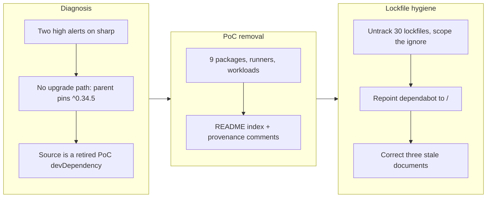

## 1. Overview

Two open high-severity dependabot alerts turned out to be the visible end of two pieces of unfinished cleanup: a PoC fleet that had been retired from the gates but never deleted, and a workspaces migration that switched to one root install but left every per-package lockfile tracked. Removing the nine PoC packages and untracking the stale lockfiles clears both alerts, and repointing dependabot's scan path makes the tool read the one lockfile that is actually live.

**Highlights:**

1. Deleted the nine `packages/plgg-poc*` packages with their runners, workloads and README entries — 297 files, 49,024 deletions
2. Untracked all 30 remaining `packages/*/package-lock.json`, with a `packages/*`-scoped ignore rule so the root lockfile stays tracked
3. Repointed `.github/dependabot.yml` from `/packages/*` to `/`, where the only live lockfile has been since 2026-08-01
4. `npm audit` reports 0 vulnerabilities; `sharp`, `@huggingface/transformers` and every `plgg-poc` entry are gone from the regenerated root lockfile

## 2. Motivation

The alerts named `sharp` < 0.35.0 (four libvips CVEs, high). `sharp` was not a direct dependency of anything: it arrived transitively through `@huggingface/transformers`, a devDependency of `plgg-poc1-search`. There was no version to upgrade to — even the latest `@huggingface/transformers@4.2.0` declares `sharp: ^0.34.5`, and a caret on a 0.x version pins the minor, so 0.35.x is out of range and npm reports `fixAvailable: false`. The only in-place fix would have been an `overrides` block forcing a version the parent explicitly declines to cross.

That fix was not taken, because the developer's answer to "how should we dispose of this" was that the PoC packages themselves are finished. The record supports it: all nine were already absent from `scripts/build.sh`'s 29-package order and from every check-all gate, all were `private` and never published, and their owning mission closed `achieved` with the verdicts recorded. `@huggingface/transformers` had entered under an explicit, time-boxed exemption — *"PoC-only deps allowed… built to discard, verdict is the deliverable"* — and the verdict was delivered on 2026-07-16. Deleting the fleet retires the dependency at its source instead of pinning around it.

The second half was found while tracing why one CVE produced two alerts. The npm-workspaces migration measured and published *"Lockfiles 39 → 1"*, but that row measured what an install **writes**; all 39 per-package lockfiles stayed **tracked**, froze on 2026-07-13 while the root one was rewritten on 2026-08-01, and went on being read as current. Worse, `.github/dependabot.yml` still declared *"No root package.json/workspaces: each packages/\* dir is its own install root"* and scanned `/packages/*` only — so update PRs were proposed against frozen manifests and the live root lockfile was never opened.

## 3. Changes

The two tickets were driven as one unit because the second depends on the first: deleting the fleet took nine of the thirty-nine lockfiles with it, so the ordering keeps the counting honest. The deletion had to be all-or-nothing by construction — five sibling PoCs `file:`-depend on `plgg-poc1-search` — so a partial removal would either break the link or keep the vulnerable dependency.

### 3-1. PoC フリートの 9 パッケージを撤去する ([3300c72b](https://github.com/qmu/plgg/commit/3300c72b))

Deleted the nine packages (142 TypeScript files), their nine test runners, `serve-poc.sh`, nine `workloads/poc*/` and the nine README index entries. Four plggpress dev-server comments cited PoC source paths as the provenance of promoted code; they were rewritten to keep the lineage while no longer pointing at files that do not exist.

### 3-2. workspaces 移行が取り残した 39 個の lockfile と、それを前提にした dependabot 設定 ([f7c99443](https://github.com/qmu/plgg/commit/f7c99443))

Untracked the remaining 30 lockfiles behind a `packages/*/package-lock.json` ignore rule spelled in full, repointed dependabot to `/`, and corrected three documents that still described a pre-workspaces repository: the decision doc's lockfile row, the root manifest's `SPIKE` self-description, and two comments claiming `build.sh` runs `npm ci` when it runs a root `npm install`.

## 4. Outcome

`npm audit` reports 0 vulnerabilities. A full regeneration of the root lockfile dropped 1,314 lines and left zero `sharp`, zero `@huggingface/transformers` and zero `plgg-poc` entries. `git ls-files` finds no `packages/*/package-lock.json` and still finds the root one; `git check-ignore` exits 0 for a package lockfile and 1 for the root, so the rule cannot swallow the file it must protect. `scripts/npm-install.sh` leaves the tree clean.

`./scripts/check-all.sh` is green at 30 checks (down from 39 — the nine PoC test runners are gone, not skipped), and the guide still builds all 40 pages with its dead-link check.

## 5. Concerns

### check-all has no dependency-vulnerability gate

- **Severity:** moderate
- **Description:** Nothing in `scripts/check-all.sh` runs `npm audit` or any equivalent, so a vulnerable dependency is invisible to the repository's own inspection command and surfaces only as a GitHub alert someone happens to read. `workaholic:operation` / `ci-cd` asks for build, type checking, tests, lint **and dependency vulnerability scanning** in one command, and `.workaholic/policies/security.md` already names this exact gap ("There is no npm audit step"). This branch cleared today's finding without closing the hole that let it sit unnoticed (see [f7c99443](https://github.com/qmu/plgg/commit/f7c99443) in `scripts/check-all.sh`).
- **How to Fix:** Add an audit gate to `check-all.sh` at a chosen severity floor, deciding deliberately whether a dev-only advisory should fail the gate or only report — the answer shapes whether the gate is usable day to day.

### No risk register exists for an accepted vulnerability

- **Severity:** low
- **Description:** `workaholic:safety` / risk-management requires an accepted risk to be recorded by name with a decision-maker and a time limit, in operating documents under `docs/safety/`. That directory does not exist. Today's finding was disposed of by removal so nothing needed accepting, but the next dev-only advisory has no sanctioned destination — and the repository has already made such a call once informally (the lodash finding in the unpublished `example` package, recorded in `.workaholic/policies/security.md`).
- **How to Fix:** Create the register when the first advisory genuinely needs accepting rather than pre-building it, and move the existing lodash note into it at that point.

### The cloudflared ingress still routes the deleted PoC hosts

- **Severity:** low
- **Description:** Nine `plgg-poc*.qmu.dev` hostnames remain in `~/.cloudflared/config.yml` pointing at local ports nothing listens on. That file is server configuration outside this repository, so it was deliberately left alone rather than mixed into a code change's acceptance (see [3300c72b](https://github.com/qmu/plgg/commit/3300c72b)).
- **How to Fix:** Remove the nine ingress rules and their DNS routes on the server, at whatever moment suits the operator; nothing breaks while they linger beyond returning a connection error.

## 6. Successful Development Patterns

- Tracing an alert to its owner before choosing a fix changed the answer entirely: the mechanical response was an `overrides` pin asserting compatibility across a boundary the parent declined to cross, with nothing in the repository able to catch that assertion being wrong — no spec imports the module that loads `sharp`. Asking whose dependency it was first surfaced that the owner was disposable.
- A measurement row can be true and still mislead. *"Lockfiles 39 → 1"* correctly measured what an install writes, and was read as what remains tracked. When a number lands in a decision document, saying which question it answers costs one clause and prevents the drift that followed here.

## Deployment Evidence

- **When:** 2026-08-07T00:30:00+09:00
- **By:** a@qmu.jp
- **Target:** release-scan
- **Method:** none (unit demoted to the PR path)
- **Status:** blocked
- **Observed:** size finding: rule too-many-files, 314 files in the diff > 100. No hard or leak findings. 297 of those files are the PoC deletion this unit exists to perform, so the count is the work rather than a symptom. An override is a human ruling, so the unattended run stopped here instead of taking it.
