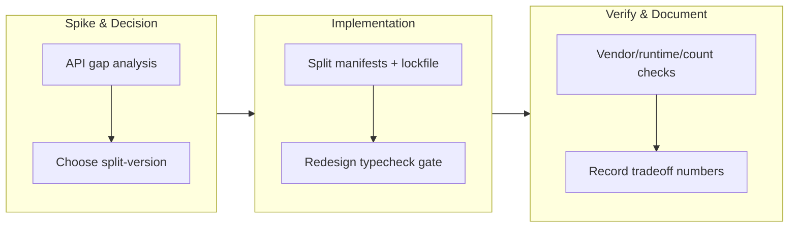

## 1. Overview

Migrated the repository's TypeScript toolchain to 7.0.2 (the Go-native compiler) via a split-version strategy: 27 manifests plus the workspace root moved to TS7, while plgg-bundle and plgg-test — whose runtime dependencies ship to npm users and rely on APIs TS7 removed — deliberately stay on TS6, resolved as nested copies. Every gate is green, per-package test counts are identical before and after, and dependabot PR #112 is superseded.

**Highlights:**

1. Split-version layout: root + 27 manifests on `typescript@^7.0.2`, TS6 nested under the 2 publishing packages — hoist made deterministic by an explicit root declaration
2. Typecheck gate redesigned from the removed incremental compiler API to per-package native `tsc` processes (cold run 21.4s → 11.4s; incremental is gone, 11.4s flat)
3. The native-binary tradeoff is recorded with measurements in plgg-bundle's DEPENDENCY-LOG (build 89.0s → 59.0s, check-all 121.3s → 127.1s)

## 2. Motivation

TypeScript is not an ordinary dependency here — the no-escape-hatch rule makes the compiler the guarantee floor, and TS 7.0.2 is a Go reimplementation that removed `transpileModule` and `preProcessFile`, the APIs plgg-bundle's transpiler, plgg-test's loader hook, and the vendor-boundary analyzer are built on. Merging dependabot's uniform 29-manifest bump (#112) would have shipped a broken bundler and test runner to npm users. The T1 spike measured the gap symbol by symbol; on that evidence the developer chose split-version (2026-08-13): move the toolchain to TS7 for its native speed, keep the two publishing packages on TS6, and record the cost in numbers.

This repository has removed native bindings before — the rolldown darwin-only binding broke Deploy Guide CI (DEPENDENCY-LOG, 2026-06) and shedding vite existed to retire that class of dependency. TS7 reintroduces platform-specific optional binaries for the toolchain only; the packages npm consumers install remain pure-JS.

## 3. Changes

The spike proved a naive port impossible — `transpileModule` and `preProcessFile` are absent from every adoptable 7.x — so the work pivoted to a split-version layout, a process-driven typecheck gate, and evidence that the TS6 consumers keep working: identical test counts across 29 packages, byte-identical JS bundles, and a violation-detection proof for the gate that type-checking cannot see.

### 3-1. TS7 API ギャップを実測でマップする ([ea423fbc](https://github.com/qmu/plgg/commit/ea423fbc))

Measured every compiler-API symbol the five consumers use against the 7.0.2 tarball: `transpileModule`/`preProcessFile` absent, `unstable/sync` Checker present, no incremental API. Includes a working scanner PoC (with its silent signature trap) and the 28/29 tsconfig reproduction log.

### 3-2. split-version 構成の実装と TS6 消費者の検証 ([476ce098](https://github.com/qmu/plgg/commit/476ce098))

27 manifests + root to `^7.0.2`, lockfile regenerated (all 20 platform nodes pinned), TS6 nested under plgg-bundle/plgg-test. Verified the three TS6 consumers, compared dists (JS byte-identical; two semantically-equivalent .d.ts differences explained), and proved per-package test counts unchanged.

### 3-3. plgg-test ローダフックは移植不要と記録 ([aa395649](https://github.com/qmu/plgg/commit/aa395649))

The loader hook keeps resolving nested TS6 `transpileModule` unchanged; 147 tests pass as before and the cross-runtime gate is green on node, deno, and bun.

### 3-4. typecheck ゲートを TS7 native tsc 駆動に再設計 ([d7abd23a](https://github.com/qmu/plgg/commit/d7abd23a))

`scripts/typecheck.ts` no longer imports the compiler API: it spawns each package's own declared `tsc` (TS7 native for 27, nested TS6 for 2) in a bounded pool, keeping colored positioned diagnostics. Error detection proven on both compiler routes; `--jobs 2` caps the gate inside runTests' pool (uncapped, pool multiplication took the test phase 30s → 61s).

### 3-5. TS7 を正式採用しトレードオフを数字で記録 ([b7f3694b](https://github.com/qmu/plgg/commit/b7f3694b))

Both decisions recorded in plgg-bundle's DEPENDENCY-LOG with measurements; a negative-control corpus (`as` cast, non-exhaustive `never`, brand bypass, bare `null` for `Option`) is still rejected under TS7; three stale descriptions of the old gate corrected; #112 to be closed as superseded.

### 3-6. vendor-boundary アナライザは移植不要と記録 ([93376d9a](https://github.com/qmu/plgg/commit/93376d9a))

The analyzer resolves typescript through plgg-bundle and keeps TS6 `preProcessFile`; proven alive by inserting a third-party import outside `vendors/` (gate exits 1, names the file) and restoring it (exits 0).

## 4. Outcome

The toolchain runs TypeScript 7 native; the two npm-publishing packages keep their pure-JS TS6 dependency, so no native binary reaches consumers. All gates green (check-all exit 0), 29-package test counts identical, and the migration's cost — losing incremental typecheck for a flat 11.4s full run, +6s on check-all, −30s on build — is recorded where the vendor-neutrality policy requires.

## 5. Concerns

### Dependabot collides with the split-version strategy

- **Severity:** moderate
- **Description:** dependabot proposes uniform 29-manifest bumps; split-version needs 27 to move and 2 to stay. Every future 7.x release will re-open an all-or-nothing PR like #112 (see [914914bf](https://github.com/qmu/plgg/commit/914914bf))
- **How to Fix:** Add dependabot `ignore` rules exempting plgg-bundle and plgg-test's `typescript` from major bumps

### Scanner route for dropping TS6 entirely remains unexercised

- **Severity:** low
- **Description:** The TS7 scanner PoC in docs/typescript-7-api-gap.md (including the changed `createScanner` signature that fails silently) is the migration path if TS6 is ever fully dropped, but no production code exercises it yet (see [ea423fbc](https://github.com/qmu/plgg/commit/ea423fbc))
- **How to Fix:** Re-evaluate at each TS 7.x minor; port the analyzer via the PoC when a file-level transpile API lands for the other two consumers

## 6. Successful Development Patterns

- Spike-then-decide: T1's symbol-by-symbol measurement made "port is impossible" a fact before any code moved, so the route change cost a decision, not a rewrite
- Explicit root declaration to control npm hoist: intentional multi-version coexistence only works when the root manifest names the toolchain's version — npm's hoist is not majoritarian (measured 27:2 inverted)
- Compiler-as-subprocess for a removed API: spawning each package's own declared `tsc` preserved per-package options, diagnostics, and the split semantics in one seam

## 7. Release Preparation

**Verdict**: Ready for release

- **Before release:** Confirm this PR's `run-tests` (check-all) workflow is green — the ubuntu x64 runner resolves `@typescript/typescript-linux-x64`, a path never exercised locally (only linux-arm64 was)
- **After release:** Watch the next dependabot typescript PR: it will again propose bumping all 29 manifests, which the split deliberately rejects

## 8. Notes

No package version was bumped: only devDependency ranges and repository tooling changed, and the published artifacts (`files: bin/dist`) are byte-identical — the runtime `typescript` dependency of plgg-bundle/plgg-test is unchanged at `^6.0.3`.
