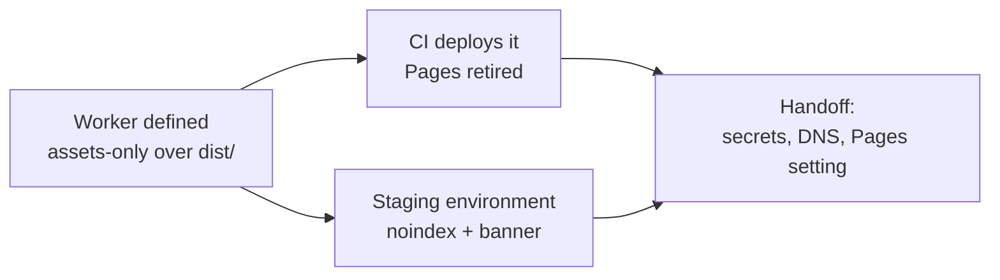

## Handoff

**This branch is complete but unverified here. Someone must verify it before it merges.**

- **Done:** The guide's whole delivery surface is defined in this repository and
  proven against the real Worker runtime — a production Worker over `dist/`, the
  merge-to-`main` workflow that deploys it, and a staging environment at
  `staging-plgg.qmu.co.jp` that is noindexed and visibly pre-production. All three
  tickets are archived and `scripts/check-all.sh` is green.
- **Not done:** quoted verbatim from the tickets' `verification_handoff:` —
  - "The cutover needs the Cloudflare account and a CLOUDFLARE_API_TOKEN
    repository secret, plus the plgg.qmu.co.jp DNS record in the corporate
    repository's infra/terraform/cloudflare-dns/ — none of which an unattended run
    holds."
  - "The staging hostname needs a DNS record in the corporate repository's
    infra/terraform/cloudflare-dns/ and a Cloudflare account the unattended run
    cannot reach, so the live https://staging-plgg.qmu.co.jp/ check runs on a
    person's machine."
- **Next step:** run it where the account exists, in this order — the order is
  load-bearing, not a preference:
  1. **Before merging**, add the `CLOUDFLARE_API_TOKEN` (scope: Workers Scripts —
     Edit, this account only) and `CLOUDFLARE_ACCOUNT_ID` repository secrets. The
     deploy step fails loudly without them, by design.
  2. Raise the DNS changes in the corporate repository's
     `infra/terraform/cloudflare-dns/`: `plgg.qmu.co.jp` and
     `staging-plgg.qmu.co.jp`, both **proxied**, in the `qmu.co.jp` zone.
     `plgg.qmu.co.jp` is currently **DNS-only** — the standing concern
     `20260703041111-https-enforcement-and-proxied-mode-follow.md` records the
     grey-cloud decision — and Cloudflare refuses a Worker route on an unproxied
     hostname, so this lands before any deploy carrying a route.
  3. Confirm Universal SSL's `*.qmu.co.jp` already covers both hostnames **before**
     the flip. Both are one label deep so it should; if it does not, stop and report
     rather than provisioning a per-host certificate.
  4. Deploy and probe: `curl -sSI https://plgg.qmu.co.jp/` plus a nested and a
     generated package page; `curl -sSI https://staging-plgg.qmu.co.jp/` for
     `x-robots-tag: noindex` and `/robots.txt` for the disallow-all body;
     `openssl s_client -connect staging-plgg.qmu.co.jp:443` for the covering cert.
  5. Retire GitHub Pages in the repository settings — the Pages configuration and
     the `plgg.qmu.co.jp` custom domain. It is a repository setting with no `CNAME`
     file in the tree, so no commit here can do it, and leaving it puts two
     publishers on one hostname.
- **Attempted:** Not attempted — declared unrunnable in an unattended environment at
  ticket creation (`verification_handoff:` on
  `20260818072004-deploy-the-guide-to-the-production-worker-on-merge-and-retire-github-pages.md`
  and `20260818072009-stand-up-the-staging-surface-at-staging-plgg-qmu-co-jp.md`).
  The one probe that was tried returned
  `curl -sSI https://plgg.qmu.co.jp/ → curl: (56) CONNECT tunnel failed, response 403`,
  the session's egress proxy refusing the host.

## 1. Overview

The guide's delivery moves off GitHub Pages onto Cloudflare Workers and gains the
staging surface it never had, defined here and proven against the real Worker
runtime. What remains is the account work the tickets declared unrunnable unattended.

**Highlights:**

1. Production is an **assets-only** Worker — no script, because a pre-rendered tree needs none.
2. A merge to `main` now runs `wrangler deploy` through the guide's own script; the Pages path is gone.
3. Staging serves the identical `dist/`, marked noindex and pre-production by the one environment that has a script.

## 2. Motivation

The instruction asked for both halves to move: production off Pages onto a Worker
deployed on merge, and staging at `staging-plgg.qmu.co.jp` — one label under the same
zone, so Universal SSL's `*.qmu.co.jp` covers it with no per-host certificate.

The hostname has moved before. `work-20260703-020116` put the guide on
`plgg.qmu.co.jp` and left two standing concerns: a degraded window between the CNAME
flip and the matching deploy, and a record deliberately left DNS-only. Both are the
sequencing this branch must respect, which is why Handoff is numbered steps rather
than advice.

## 3. Changes

The Worker was built and proven first, on nothing but `wrangler dev`, so the delivery
surface existed before anything about the live site changed. Only then did the
workflow switch publishers, and only then did staging fork off it as a second
environment over the same build. Each step left the live site exactly as it found it;
the three account-bound acts that would not have are the handoff.

### 3-1. Serve the guide from a Cloudflare Worker ([e7d5c837](https://github.com/qmu/plgg/commit/e7d5c837))

Adds `packages/guide/wrangler.jsonc` — an assets-only Worker over `dist/`, with
directory URLs and the rendered `404.html` handled declaratively — plus a pinned
`wrangler` devDependency and the repository-owned `deploy` script CI later calls.
Nothing about the live site changed: no route is declared here.

### 3-2. Deploy the guide to the Worker on merge ([119a7926](https://github.com/qmu/plgg/commit/119a7926))

Rewrites `deploy-guide.yml`: the build steps are untouched, the two Pages actions and
the `pages`/`id-token` grants are gone, and one deploy step runs the guide's own
script. `wrangler.jsonc` gains the `plgg.qmu.co.jp` route; the stale Pages comments in
`site.config.ts` and the Pages topology in `OPERATIONS.md` are corrected with it.

### 3-3. Stand up the guide's staging surface ([62b6c6a5](https://github.com/qmu/plgg/commit/62b6c6a5))

Adds an `env.staging` — its own Worker, its own route, `workers_dev` off — serving the
identical `dist/`. Staging alone runs `worker/staging.ts`, which adds a noindex header,
a disallow-all `/robots.txt` and a pre-production banner. `packages/guide` gains its
first `tsconfig.json`, so the Worker is covered by the whole-repo typecheck gate.

## 4. Outcome

The guide has one publisher, defined here and deployable by two repository-owned
commands, plus a pre-production surface that cannot be indexed or mistaken for it.
`check-all.sh` is green, typecheck now reaching `packages/guide` for the first time.

## 5. Concerns

### Merging before the Cloudflare secrets exist turns `main` red

- **Severity:** urgent
- **Description:** the deploy step runs unconditionally and fails without `CLOUDFLARE_API_TOKEN`/`CLOUDFLARE_ACCOUNT_ID`; gating it was rejected because a green run that published nothing is worse (see [119a7926](https://github.com/qmu/plgg/commit/119a7926) in `.github/workflows/deploy-guide.yml`)
- **How to Fix:** add both repository secrets before merging — Handoff step 1

### Two publishers survive until the Pages setting is retired

- **Severity:** urgent
- **Description:** the workflow's Pages path is gone, but the repository's Pages configuration and its `plgg.qmu.co.jp` custom domain are settings, not files, so no commit here removes them (see [119a7926](https://github.com/qmu/plgg/commit/119a7926) in `.github/workflows/deploy-guide.yml`)
- **How to Fix:** retire Pages and its custom domain in repository settings at cutover — Handoff step 5

### The Worker shape was chosen without reading the named reference

- **Severity:** moderate
- **Description:** the instruction named `qmu-co-jp`'s `packages/site` as the reference; this session's GitHub access is scoped to `qmu/plgg` and the read was refused, so Static Assets was chosen on its merits rather than mirrored (see [e7d5c837](https://github.com/qmu/plgg/commit/e7d5c837) in `packages/guide/wrangler.jsonc`)
- **How to Fix:** open the reference and converge if it differs — a config-level change, not a rewrite

### `worker/staging.ts` has no colocated spec

- **Severity:** moderate
- **Description:** `packages/guide` carries no test harness, so the house one-spec-per-function standard is unmet; the file is covered end to end against the real runtime and by the typecheck gate instead (see [62b6c6a5](https://github.com/qmu/plgg/commit/62b6c6a5) in `packages/guide/worker/staging.ts`)
- **How to Fix:** decide whether the guide package should carry `plgg-test` — it needs the file under `src/`

### The staging surface has no trigger

- **Severity:** low
- **Description:** staging deploys only by hand; the ticket left what should trigger it to the mission's approval interrogation (see [62b6c6a5](https://github.com/qmu/plgg/commit/62b6c6a5) in `packages/guide/package.json`)
- **How to Fix:** once decided, add one job to `deploy-guide.yml` calling `deploy:staging`

### Stale GitHub Pages references remain in unrelated packages

- **Severity:** low
- **Description:** `plgg-server/src/Ssg/usecase/writeStatic.ts` and `plggpress/src/CheckLinks/usecase/checkLinks.ts` still explain their behaviour in terms of a Pages deploy; the behaviour is unchanged, only the naming is stale (see [119a7926](https://github.com/qmu/plgg/commit/119a7926))
- **How to Fix:** reword both comments the next time either file is opened

## 6. Successful Development Patterns

- Probing the real runtime found what review could not: `run_worker_first` was missing, and only a request to a *real* page — not a dry run, not the 404 — exposed it.
- Building the delivery surface before touching the publisher meant every step was provable while the live site was still served by the old one.
- Splitting ownership by resource (wrangler owns routes, Terraform owns records) kept a cross-repository boundary from becoming a shared write.

## 7. Release Preparation

**Verdict**: Needs attention before release

- **Concern:** the branch cannot be verified where it was written; every acceptance criterion that names a live URL is unproven here
- **Before release:** add both Cloudflare repository secrets, then land the proxied DNS records in the corporate Terraform repository
- **After release:** confirm the post-merge deploy run is green, probe both hostnames and the Universal SSL certificate, then retire GitHub Pages and its custom domain
